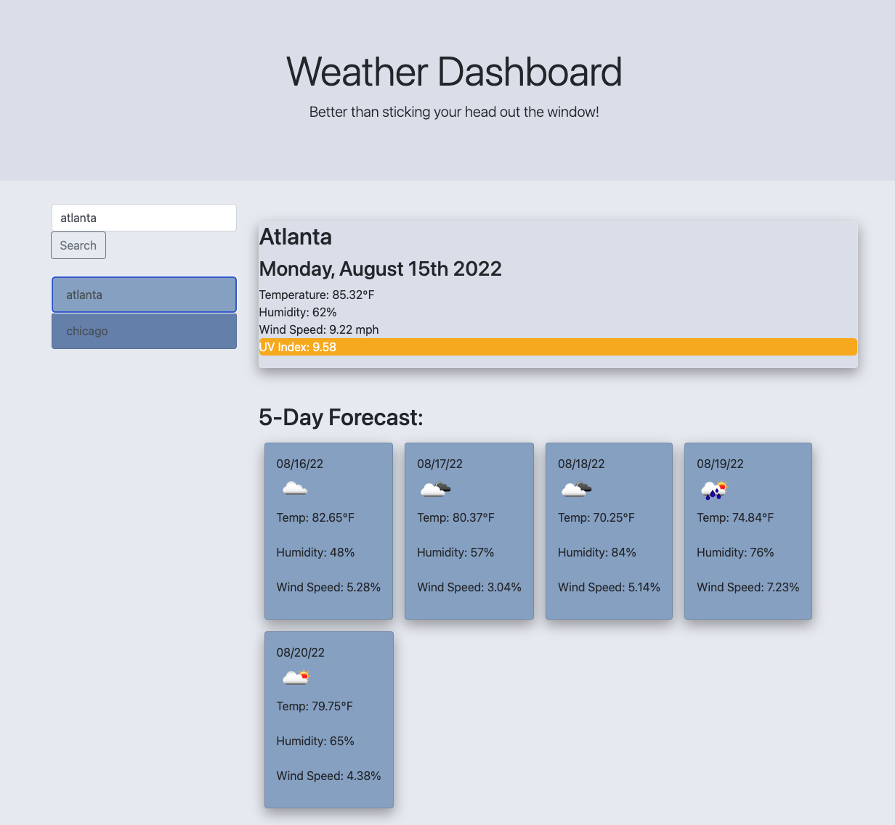

# 06-Weather-Dashboard

## Description

This is the module 06 "Weather Dashboard" by Jonathan Shogren. The challange was to make an weather dashboard that can take in a searched city, return the current weather and the 5 day forcast, and save previous searched cities.

Here is a link to the live finished page:

## User Story

>AS A traveler
>
>I WANT to see the weather outlook for multiple cities
>
>SO THAT I can plan a trip accordingly

## Screenshot

Here is a screenshot of the finished site:

## Additional Notes

* I didn't have a lot of time to work on this outside of class this week, so some features are incomplete:
  * the search history only appears after you refresh the page, not when the city is searched
  * the UV index color and numbers are off
